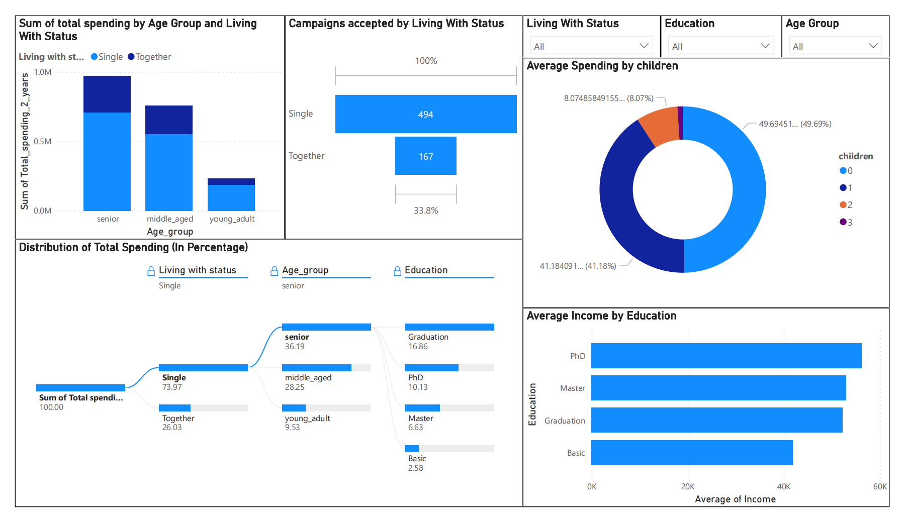

# Customer_Segmentation

Customer segmentation is the practice of dividing customers into groups based on similarities in their behavior and characteristics. This project focuses on performing unsupervised clustering of customer records from a groceries firm's database. The primary objectives are:

- To optimize marketing strategies by tailoring products and services to the distinct needs and behaviors of customer segments.
- Use this for target marketing and promotions to specific group of customers effectively.

## Dataset 

link - https://www.kaggle.com/datasets/imakash3011/customer-personality-analysis/data

Data Dashboard

## Methodology

The project follows these main steps:

1) Data Cleaning: Outliers, missing values, and categorical variables are addressed to ensure data quality.

2) Feature Engineering: New features are created to capture important aspects of customer behavior.

3) Dimensionality Reduction: Techniques like Principal Component Analysis (PCA) may be used to reduce the number of features.

4) Clustering: K-means clustering is applied to create customer segments. The number of clusters is determined through analysis.

5) Customer Profiling: Insights are extracted from each cluster, profiling customers based on various factors.

## Cluster characteristics

##### 1) Cluster 0 :

- Older than average
- Definitely a parent
- Mostly a couple
- Almost all did not accept promos
- Income low and spending also low
- High number of visits but low purchasing power

#### 2) Cluster 1 :

- Average age
- Almost none are parent
- About half are couples
- A large part accepted promos
- Income high and spending also high
- Less number of visits but more purchasing power
- There is a large potential that can be explored in this group of customers

#### 3) Cluster 2 :

- Relatively younger in age
- mostly a parent
- About half are couples
- Almost all did not accept promos
- Income very low and spending also very low
- Visits high but very low purchasing power

#### 4) Cluster 3 :

- Relatively older in age
- Almost definitely a parent
- More than half are couples
- One third people accepted promos
- Income is high and spending is also high
- More visits and high spending
- This group of customers are biggest revenue generator

